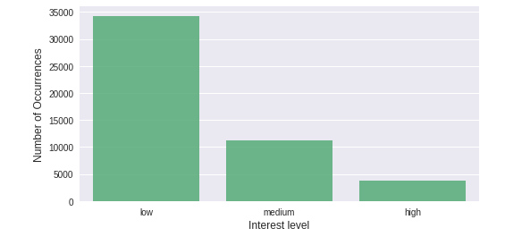
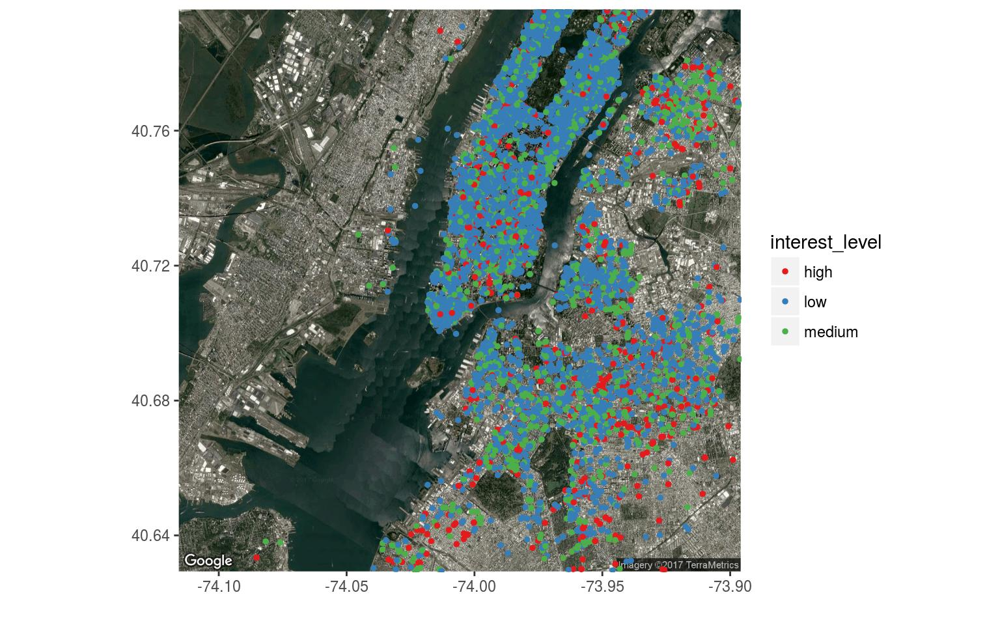
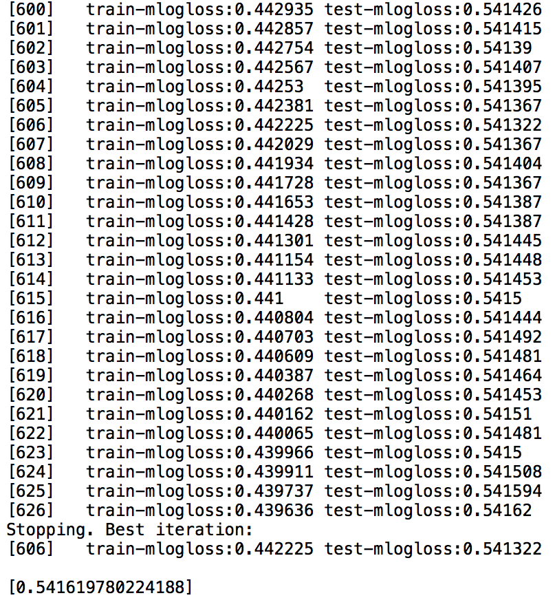

```{r setup, include=FALSE}
knitr::opts_chunk$set(echo = FALSE)
```

## Two Sigma Connect: Rental Listing Inquiries
- This project is organized by Two Sigma and RentHop

- We predict the number of inquiries a new listing receives based on the listing’s creation date and other features. 

- Handle fraud control, identify potential listing quality issues, and allow owners and agents to better understand renters’ needs and preferences.


## Overview of the Data
 There are in total 15 data fields listed in the original file.

- bathrooms: number of bathrooms
- bedrooms: number of bathrooms
- building_id
- created
- description
- display_address
- features: a list of features about this apartment
- latitude

## Overview of the Data (Continued)
- listing_id
- longitude
- manager_id
- photos: a list of photo links
- price: in USD
- street_address
- interest_level: this is the target variable. It has 3 categories: 'high', 'medium', 'low'

## Visualization of Key Features

<div align="center">

</div>

Interest level is low for most of the cases followed by medium and then high which makes sense.

## Visualization of Key Features

<div align="center">

</div>

There are three probability distributions for different interest levels.

## Visualization of Key Features

<div align="center">

</div>

The price distribution is right skewed.

## A Survey of Methods we use
The method we employ is Gradient Boosting. The idea is to create a strong model out of an ensemble of weak models. 

- Iteratively build the classifyier from weak classifiers

- (i.e.) If the weak classifier is a line, then the strong classifier is a complex shape defined by many lines

- The relative importance of data point to the cost function is determined by a specific loss function

- If in one iteration, the data is correctly classified, the algorithm will reduce the relative importance of that data point, vise versa


## Data Spliting and Cross Validation

- original test.json (74659 rows)
- original train.json (49352 rows)
    - training (0.7*49352)
    - validation (0.3*49352)
- before each submission, we validate our model using the validation set


## Preprocessing the Data

- Motivation: We want to fully exploit the training data to better predict the testing data
- Chanllenge: How to make use of the features in training set


<div align="center">

</div>


## Preprocessing the Data

- The features column in training set

<div align="center">

</div>


## Preprocessing the Data

- Idea:      Extract the key features such as 'pets allowed' and 'parking', make each of them a new feature and append to the end of the data set

- Problem:  How do we know which is the key feature?

- Solution: Frenquency of words appear in features

<div align="center">

</div>

## Preprocessing the Data

- Example of 'allowed'

<div align="center">

</div>

- Create new features: pets allowed, cats allowed, dogs allowed, short-lease allowed

## Preprocessing the Data

- Example of 'laundry'

<div align="center">

</div>

- Create new features: laundry in units, laundry in building


## Preprocessing the Data
- We should do this for all the key words with high frequency
- Search terms in each row

<div align="center">

</div>


## Preprocessing the Data

- New features Added

<div align="center">

</div>

## Preprocessing the Data

- There are more information that we can use such as 'bedroom', 'bathroom', 'price'

- Creat more new features called: {
                        'price_ratio',
                        'room_ratio',
                        'bath_price_ratio',
                        'beds_price_ratio',
                        'bed_bath_diff',
                        'price_feature_ratio',
                        'price_photo_ratio',
                        'has_photo'}
- Append those new features to the data set

## Preprocessing the Data
- Define the ratios:

- price_ratio = price/(bed room + bath room)
- room_ratio = bedrooms/bathrooms
- bath_price_ratio = price / bathrooms
- beds_price_ratio = price / bedrooms
- bed_bath_diff = bedrooms - bathrooms
- price_feature_ratio = num_features / price
- price_photo_ratio = num_photo / price


## Geocoding

- Each listing has two important geo-features: latitude and longitude
- We suspect that rental prices are different in different neighborhood, thus we use QGIS to find shapefiles of New York and geocode each data point to its corresponding neighborhood
- Thus, we can compare each listings' price/room ratio with the average price/room ratio in each neighborhood

## Geocoding

<div align="center">

</div>

## Labeling Categorical Values

- In order to factorize categorical features such 'manager_id', 'building_id' etc., we first find the unique ones and assign each with a unique number
- For example, 'manager_id' originally is in the form : 'b1b1852c416d78d7765d746cb1b8921f'. 
- If there are 18000 unique manergers, we will replace the original id with numerical labels from 1-18000

## Xgboost

- XGBoost is an optimized distributed gradient boosting library designed to be highly efficient, flexible and portable. 
- It implements machine learning algorithms under the Gradient Boosting framework. 
- XGBoost provides a parallel tree boosting that solve many data science problems in a fast and accurate way.

## Regression Tree(CART)

-  regression tree (also known as classification and regression tree):
    - introduced by Leo Breiman to refer to Decision Tree algorithms that can used for classification or regression predictive modeling problems.
    - Decision rules same as in decision tree 
    - Contains one score in each leaf value

## Regression Tree(CART)

<div align="center">

</div>

## Tree Ensemble methods

- A regression tree ensemble is a predictive model composed of a weighted combination of multiple regression trees.
- Very widely used, look for GBM, random forest...
    - Almost half of data mining competition are won by using some variants of tree ensemble methods
- Invariant to scaling of inputs, so you do not need to do careful features normalization.
- Learn higher order interaction between features.

## Implementation

- The model is being trained iteratively.
- Trees are added one at a time, and existing trees in the model are not changed.
- A gradient descent procedure is used to minimize the loss when adding trees.

## Implementation

<div align="center">

</div>

## Evaluation Criterion

- We will be evaluting our result using Multiple-Log-Loss function

$$logloss = -\frac{1}{N}\sum^{N}_{i=1}\sum^{M}_{j=1}y_{ij}log(p_{ij})$$

where $N$ is the number of listings in the test set, $M$ is the number of class labels (3 classes), $y_{ij}$ is 1 if observation $i$ belongs to class $j$ and 0 otherwise, and $p_{ij}$ is the predicted probability that observation $i$ belongs to class $j$.

## Feature importance

<div align="center">

</div>

## Results

- Our best result obtained from Kaggle is 0.546 (ranks 150/1200)
- The best team scored approximately 0.501

## Areas of Improvement

- We could also include images provided by the host to train our model (78GB data)
- We could use grid search for parameter tuning to improve our model (> $6^{10}$ combinations)

## Questions?

## The End


